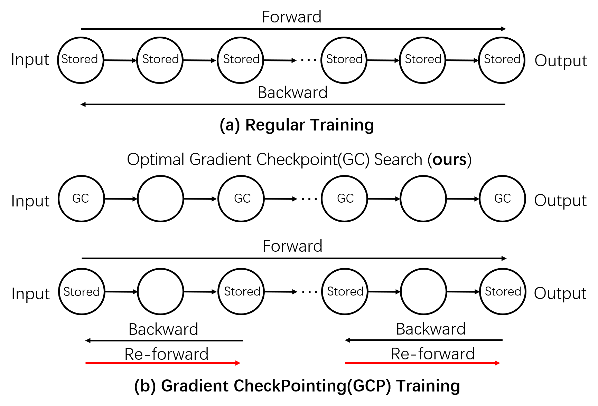
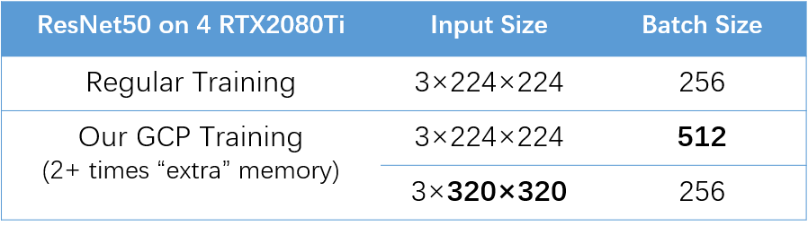

# Optimal Gradient Checkpoint Search for Arbitrary Computation Graphs
This is the official implementation of the paper: 

**Jianwei Feng and Dong Huang**, ***Optimal Gradient Checkpoint Search for Arbitrary Computation Graphs***, **CVPR, 2021 (Oral)**. [ArXiv version](https://arxiv.org/abs/1808.00079)

### Citation: 

```bash
@inproceedings{fenghuang2021,
  title={Optimal Gradient Checkpoint Search for Arbitrary Computation Graphs},
  author={Jianwei Feng and Dong Huang},
  booktitle={CVPR},
  year={2021}
}
```

**Regular Training vs. Gradient CheckPointing(GCP) Training:** **(a)** The regular training stores all tensors during forward, and uses these tensors to compute gradients during backward. **(b)** GCP stores a subset of tensors during the first forward, and conducts extra local re-forwards to compute tensors and gradients during backward. Our approach automatically searches the optimal set of Gradient Checkpoints (GCs) for memory cut-off. Such that on the same **physical** GPU memory (e.g., in 4 RTX2080Ti GPUs), GCP training can accommodate models that require **2+** times extra GPU memory. 

<!-- .element height="20%" width="20%" -->
<!-- .element height="20%" width="20%" -->

# Reducing Training Memory by Optimal Gradient Checkpointing
| Model Name |   Input Size  |    Regular Training Memory (MB)    |     OGC Training Memory (MB)    |    Memory Cut off   |   Regular Training Time (s)  |    OGC Training Time (s)  |   Time Overhead   |
|:------------------:|:--------------:|:--------------:|:--------------:|:--------------:|:--------------:|:--------------:|:--------------:|
|       Alexnet      |      (1024, 3, 224, 224)      |      4955      |      3287      |      34%      |      0.388      |      0.519      |       34%      |
|      VGG 11      |     (64, 3, 224, 224)     |     3577     |     2781     |     22%    |     0.266     |     0.356     |      34%      |
|     VGG 13    |  (64, 3, 224, 224) | 5136 | 3565 | 31% | 0.418 | 0.558 |      33%      |
|     VGG 16     |   (64, 3, 224, 224)   |   5136   |   3565   |   31%   |   0.503   |   0.666   |      32%      |
|    VGG 19    |      (64, 3, 224, 224)      |      5189      |    3565   |       31%      |    0.581   |    0.774   |      33%      |
|     Resnet 18    |    (256, 3, 224, 224)    |    5635    |    3677    |    35%    |    0.422    |    0.548    |      30%      |
|     Resnet 34    |  (128, 3, 224, 224)  |   4079  |  1838 |  55%  |  0.364 |  0.493  |      35%      |
|    Resnet 50    |  (64, 3, 224, 224) |   5323   |  1973 |  63%  |  0.394 |  0.516  |      31%      |
|    Resnet 101   |  (32, 3, 224, 224)  |  3934  |  1024  |  74%  |  0.356  |  0.482  |      35%      |
|    Resnet 152       |   (16, 3, 224, 224)  |     2767     |   526   |   81%    |   0.241  |   0.331  |      37%      |
|  Densenet 121  |     (32, 3, 224, 224)    |     4027     |    898    |     78%    |     0.218    |     0.292    |      34%      |
|  Densenet 161  |    (16, 3, 224, 224)    |    3751   |     666    |   82%   |    0.252    |   0.341   |       36%      |
|    Densenet 169       |     (32, 3, 224, 224)   |    4862   |    897   |    82%    |    0.270   |    0.357   |      32%      |
|    Densenet 201    | (16, 3, 224, 224) |  3146  |  474 |  85% | 0.200 | 0.306 |      53%      |
|    Inception v3    | (32, 3, 300, 300)|  3074  |  881 |  71% | 0.291 | 0.374 |      29%      |
|    NASNet Cifar10   | (64, 3, 32, 32) |  5832  |  1129 |  81% | 0.408 | 0.535 |      31%      |
|    AmoebaNet Cifar10    | (64, 3, 32, 32) |  4944  |  1058 |  79% | 0.331 | 0.450 |      36%      |
|    DARTS Cifar10    | (64, 3, 32, 32) |  5627  |  1115 |  80% | 0.318 | 0.494 |      55%      |

The memory numbers in the table are calculated after removing stationary memory cost such as model weights and pytorch cuda interface.
## Installation

### Requirements:

- Python > 3.x
- Pytorch >= 1.5

### Step-by-step

Install pytorch 1.5 from https://pytorch.org/

Install other dependencies.
```
pip install -r requirements.txt
```

## Run Optimal Gradient Checkpointing
Run Optimal Gradient Checkpointing on Resnet101 and benchmark training memory cost and time cost
```
python main.py --arch resnet101 --device cuda:0
```

## Train Model with Optimal Gradient Checkpointing
An example of training on CIFAR 10 dataset can be seen at [train_cifar10.ipynb](example/train_cifar10.ipynb)

## Run Optimal Gradient Checkpointing on Custom Network
To run optimal gradient checkpointing on a custom model, you will need to provide a parse_graph function to create computation graph for your network.

An example of custom model and parse_graph function can be seen at [custom_network.ipynb](example/custom_network.ipynb)

We are aware that manually defining the parse_graph function can be tedious, and we are looking into automatically parsing computation graph using torch.jit or other tools. 
We will update it when we have found a proper solution, but so far user has to manually define the parse_graph function.
